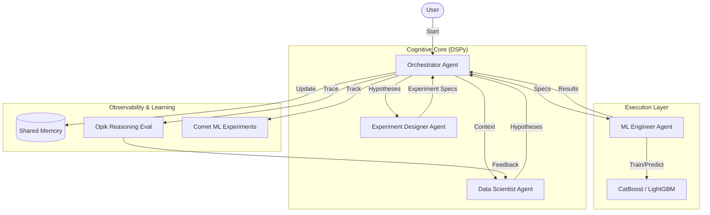

# Autonomous ML Research Agent (AMRA)

[](https://opensource.org/licenses/MIT)
[](https://www.python.org/downloads/release/python-3100/)
[](https://github.com/encodeclub/commit-to-change)

> **A multi-agent system for autonomous Kaggle competition optimization, demonstrating advanced reasoning, hypothesis generation, and self-correcting execution.**

---

## Overview

AMRA is an experimental autonomous research system designed to solve tabular machine learning competitions without human intervention. Unlike traditional AutoML (which focuses on hyperparameter tuning), AMRA mimics the workflow of a human data science team.

### Key Technical Differentiators

This project demonstrates a shift from "Static Automation" to "Cognitive AI".

#### 1. DSPy: The "Brain" Upgrade
> *Problem: Traditional agents use hardcoded prompts like "You are a data scientist". These are brittle and don't improve.*

**Our Solution**: We use **DSPy** to treat prompts as *optimizable parameters*.
- **Self-Learning**: The system observes which hypotheses lead to better CV scores.
- **Compilation**: It uses `dspy.BootstrapFewShot` to "compile" successful experiments into the agent's prompt.
- **Value**: The agent doesn't just execute; it **learns** the specific nuances of the dataset (e.g., "Log-transforms work well here") without human intervention.

#### 2. Opik: Glass-Box Reasoning
> *Problem: LLMs are black boxes. When an agent fails, it's hard to know if it was bad code or bad logic.*

**Our Solution**: We use **Opik** to trace the "Chain of Thought".
- **Granular Tracing**: We log every reasoning step (Data Analysis -> Hypothesis -> Experiment Design).
- **Automated Evaluation**: The system assigns a strictly typed feedback score (1.0/0.0) based on the experiment result.
- **Value**: This creates a dataset of "winning thoughts," allowing us to debug the *mind* of the agent, not just the code.

#### 3. Comet ML: Scientific Rigor
> *Problem: Autonomous agents generate chaos. Thousands of experiments can be run without a record.*

**Our Solution**: We use **Comet ML** as the "System of Record".
- **Full Audit Trail**: Every hyperparameter, metric, and model artifact is versioned.
- **Comparison**: We can visualize the trajectory of the agent's research (e.g., "Did the CV score plateau?").
- **Value**: Ensures that the autonomous agent produces **reproducible science**, not just random accidents.

### Agentic Workflow

The system employs a cognitive multi-agent architecture where specialized agents collaborate to:

1.  **Analyze Data**: Perform deep Exploratory Data Analysis (EDA) to understand distribution shifts, leakage, and feature interactions.
2.  **Generate Hypotheses**: Formulate testable scientific hypotheses using **DSPy-optimized Local Models**.
3.  **Design Experiments**: Translate hypotheses into concrete, executable experiment specifications.
4.  **Execute & Learn**: Train models, validate results using rigorous Cross-Validation, and update the system's knowledge base.
5.  **Self-Improve**: Failure analysis and success feedback loops allow the system to rewrite its own prompting strategies over time.

## Architecture

The system is built on a modular **Agentic Framework**, integrated with a modern MLOps stack:



### Core Agents

| Agent | Role | Responsibility |
|:---|:---|:---|
| **Orchestrator** | Team Lead | Manages the lifecycle, coordinates handoffs, and ensures goal convergence. |
| **Data Scientist** | Researcher | Uses **DSPy modules** to analyze raw data and propose hypotheses. Self-optimizes based on experimental feedback. |
| **Experiment Designer** | Architect | Translates abstract hypotheses into concrete `ExperimentSpec` objects with specific strategies and params. |
| **ML Engineer** | Builder | Executes experiments, manages CV splits, trains models, and ensures robust evaluation. |
| **Evaluator** | Auditor | Validates results against the leaderboard and acts as a gatekeeper for the "Best Score". |


## Usage

### Prerequisites
- Python 3.10+
- `uv` (recommended) or `pip`

### Installation
```bash
git clone https://github.com/your-username/amra.git
cd amra
uv sync  # or pip install -r requirements.txt
```

### Configuration
Set the following environment variables for full functionality:
```bash
export OPENAI_API_KEY="sk-..."    # Activates DSPy (GPT-4o Agent Reasoning)
export COMET_API_KEY="..."        # Activates Experiment Tracking
export OPIK_API_KEY="..."         # Activates Trace logging
```

### Running the Agent
Place your competition data in `data/` (train.csv, test.csv).

```bash
# Run the autonomous loop
uv run python examples/run_autonomous_agent.py
```

## Example Run

```log
[INFO] [Orchestrator] Starting autonomous research loop. Max iterations: 3
[INFO] [Orchestrator] --- Iteration 1/3 ---
[INFO] [DataScientist] Starting deep data analysis...
[INFO] [DataScientist] Generated 2 hypotheses: H_TARGET_ENC, H_LOG_TARGET
[INFO] [ExperimentDesigner] Designed 2 new experiments.
[INFO] [MLEngineer] Running experiment EXP_001: Test H_TARGET_ENC
[INFO] [MLEngineer] Experiment EXP_001 finished. CV: 0.2166
[INFO] [Orchestrator] NEW BEST SCORE confirmed by Evaluator: 0.2166
[INFO] [Orchestrator] Step 5: Self-Optimization
[INFO] [Orchestrator] Compiling Agent with 1 successful examples...
```

## Roadmap

- [x] **Agentic Core**: Multi-agent architecture with strict Pydantic contracts.
- [x] **Observability**: Comet ML and Opik integration.
- [x] **Cognitive Architecture**: DSPy integration for self-optimizing agents.
- [ ] **Code Generation**: Allowing the ML Engineer to write custom feature engineering code.
- [ ] **Report Generation**: Auto-generating a PDF research paper of the findings.
